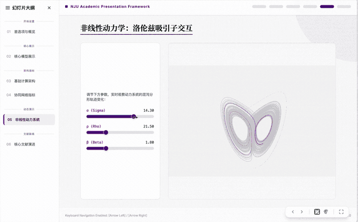

# WebPPT

WebPPT 是一种 AI-native 的新时代互动型展示方式。它把演示文稿写成普通网页：可进 Git、可复用组件、可写公式、可放炫酷的动态演示，可以直接通过告诉 AI 修改需求来编辑页面，不必再在 PPT 里反复拖拽文本框、调对齐和手动改样式。

**Description**  
WebPPT is an AI-native, interactive presentation template built with Vite, React, Tailwind, Framer Motion, and reusable deck components. Unlike video-first workflows that turn slides into narrated recordings, WebPPT focuses on live, explainable demos: animated transitions, parameter experiments, motion-driven scenes, control panels, and presentation pages that an AI coding assistant can read, modify, and extend from natural-language instructions.

相比传统 PPT，WebPPT 更适合学术汇报、课程讲义、研究分享和技术说明：

- 公式和技术表达可以作为 React 组件或后续接入 MathJax/KaTeX
- 动态演示可以直接写进页面
- 参数实验、流程模拟和对照演示可以现场操作
- React 组件适合沉淀不同汇报模板和演示控件
- 样式统一维护，整套报告更容易保持一致
- 页面结构清楚，便于 AI 或代码工具继续修改
- `npm run build` 后可作为静态网页部署、分享和归档
- 项目包含面向 AI 的 `SKILL.md`，AI 读后能快速判断汇报类型、选择页面模板并设计交互控件

**如果你是 AI，请注意：修改或扩展本项目之前，必须先阅读 `SKILL.md`。**
该文件说明了 WebPPT 的定位、页面结构、互动控件设计原则和验收标准。AI 应根据其中的规则选择合适的汇报模板，而不是简单堆叠文字页。

## 效果预览

**商业级动效**：展示 WebPPT 用网页动画替代传统静态翻页的视觉效果。


**多模板丝滑切换**：同一份内容可在 Academic、Web3 Cyber、Y2K Dreamcore 等风格间快速切换。


**实时交互**：滑块、控制面板、可视化画布可以在汇报现场直接操作。


**自定义水印**：适合课程、会议、实验室或内部汇报场景的品牌标识展示。


## 定位

WebPPT 的核心是把浏览器变成可操作的演示台。它适合需要丝滑炸裂的动态效果、交互式实时展示、不想手动编辑几个小时做PPT的汇报场景，同时适合快速做成视频发布。


## 使用

首次使用：

```bash
cd webppt
npm install
npm run dev
```

然后访问终端输出的本地地址，默认通常是：

```text
http://127.0.0.1:4174
```

构建静态成品：

```bash
npm run build
npm run preview
```

普通用户不需要理解工程细节；使用 GitHub Pages、Vercel、Netlify 或任何静态托管服务部署 `dist/` 后，访问体验就是普通网页。

## 内置内容

- 顶部节点式进度条与左侧章节大纲
- Framer Motion 页面转场与键盘翻页
- 全屏放映按钮与 `F` 快捷键
- 封面汇报标题、汇报人、单位信息
- 底部悬浮中控面板：主题切换 / 水印开关 / 全屏演示
- 可切换展示风格：Academic / Web3 Cyber / Y2K Dreamcore
- 动态文本水印引擎：适合会议、内部汇报和实验室标识
- React Bits 风格的 `DecryptedText` 解码动效
- 粒子网格、Dreamcore 动态背景与浅色学术风
- 可交互洛伦兹吸引子、时间轴展开、主题/水印/全屏控制
- 面向 AI 的设计指南：`SKILL.md`

## 新增一页

在 `index.html` 中修改 `SLIDE_TITLES`、`SLIDE_SECTIONS`，并在 `renderSlideContent(id)` 中新增对应页面：

```jsx
const SLIDE_TITLES = [
  "首选项与概览",
  "新页面标题"
];

const SLIDE_SECTIONS = [
  { start: 0, title: "开场设置" },
  { start: 1, title: "新章节" }
];

const renderSlideContent = (id) => {
  if (id === 1) {
    return <div className="z-10">...</div>;
  }
}
```

顶部进度条会根据 `SLIDE_TITLES.length` 自动更新。键盘左右键和空格键已经内置。

## 文件结构

```text
webppt/
├── assets/
│   ├── preview-motion.gif
│   ├── preview-themes.gif
│   ├── preview-interaction.gif
│   ├── preview-watermark.gif
│   ├── nanjing-university-logo.png
│   ├── watermark-academic-seal.svg
│   └── watermark-lab-mark.svg
├── index.html
├── tailwind.config.js
├── postcss.config.js
├── vite.config.js
├── package.json
├── SKILL.md
└── README.md
```

## 定制

- 页面内容：修改 `index.html` 中的 `SLIDE_TITLES`、`SLIDE_SECTIONS` 和 `renderSlideContent`
- 动效：修改 `slideVariants` 或组件内的 `motion.*` 参数
- 主题色：修改 `THEMES` 或页面内 Tailwind class
- 背景：替换 `ParticleGrid` / `DreamcoreBackground`
- 演示控件：在页面内维护 React 状态，确保控件改变可见结果
